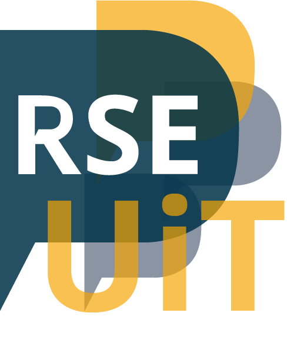

+++
+++

# Research software engineering (RSE) group at [UiT](https://uit.no)

{{ div(attributes='uk-grid') }}

{{ div(attributes='class="uk-width-auto@m"') }}

{{ enddiv() }}

{{ div(attributes='class="uk-width-1-2@m"') }}

We are starting a RSE group at UiT, following the footsteps of [UK-based
groups](https://society-rse.org/) and the [RSE group at Aalto
University](https://scicomp.aalto.fi/).

Our vision is to put UiT on the map as a place where research groups have
access to best in class RSE services. Over time we wish to attract excellent
staff, research groups, funding, collaborations, and attention.

{{ enddiv() }}

{{ enddiv() }}

## What we offer

{{ div(attributes='class="uk-column-1-2@l"') }}

- **Code review**: we look together at your code/script and give constructive feedback and advice
- Consulting and help with programming and research software engineering
- Making code more reproducible and reusable
- Help with software licenses and open sourcing
- Help with Git, GitHub, and GitLab
- Help with moving your work/project/code/data to Git
- Help with organization of reusable and reproducible Jupyter notebooks and
  Binder
- Advice and help how to best document code
- Advice about whether to use YAML or CSV or JSON or TOML or something else
- Packaging and sharing software
- Containerization (Singularity, Docker)
- Help with pip, PyPI, and Conda
- Help publishing your code
- Improving scaling, CPU, and memory footprint of research codes
- Help with modularizing your code
- Consulting and help with web development (static websites, JavaScript, HTML, CSS frameworks)
- **If you have questions about code you wrote or want to write, please contact us or come
  and talk to us**

{{ enddiv() }}

---

## What we plan to do as next steps

- Establish office hours
- [Short presentation slide deck](https://cicero.xyz/v3/remark/0.14.0/github.com/uit-no/rse-presentations/main/2022-rse-intro.md/) for research groups
- Short video which describes what we do and want to do
- Set up newsletter
